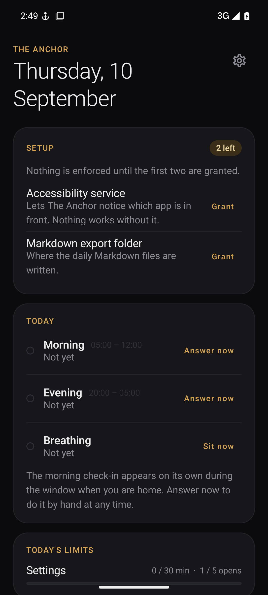
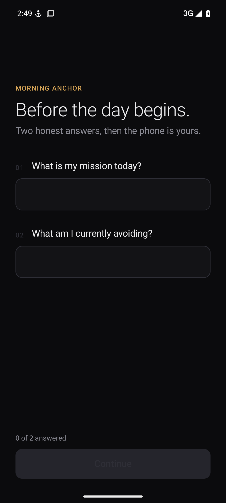
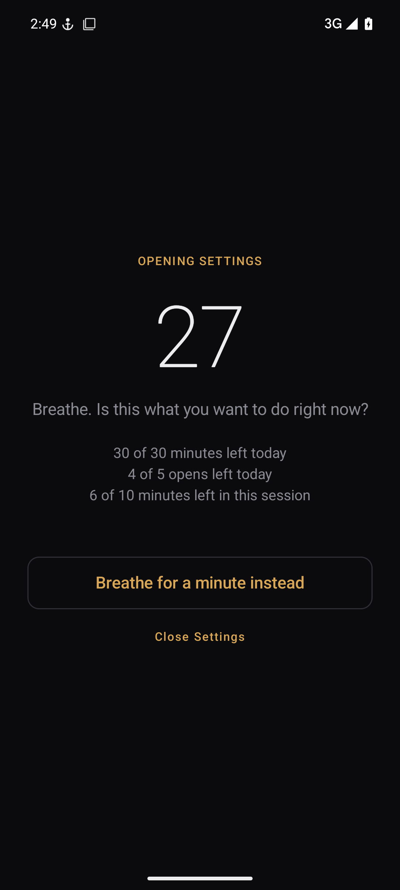
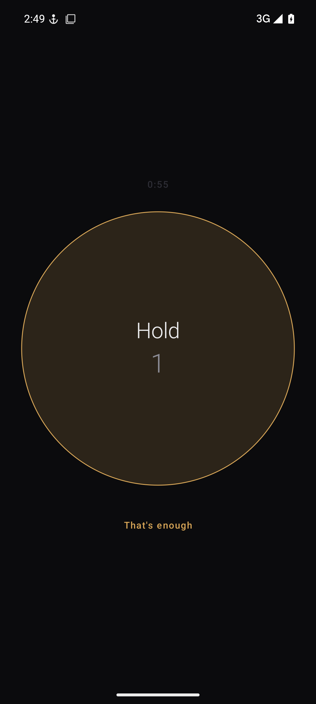
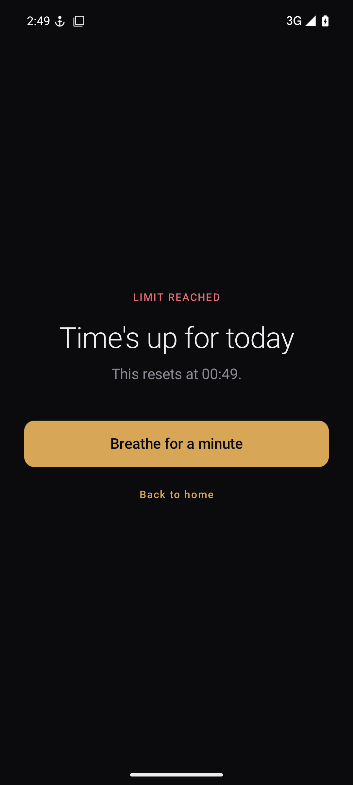
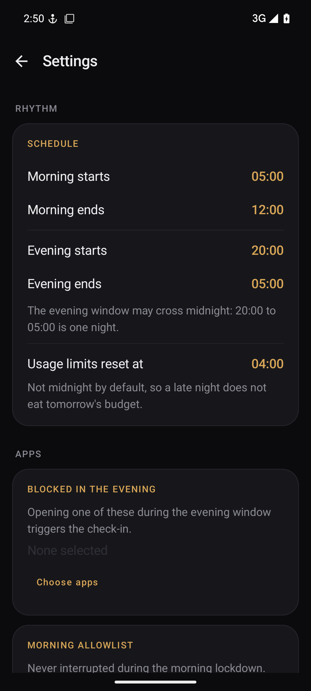

# The Anchor

A personal, self-hosted Android app that enforces a daily mindfulness protocol. It
asks you two questions in the morning before the day starts, three questions at
night before you open something you'd rather not, and holds per-app usage limits in
between. Every check-in is written to a Markdown file you own.

It is built to be sideloaded on one phone. There is no account, no server, no
telemetry. The only network calls are to a Home Assistant instance and a Joplin
instance, both of which you configure and both of which are optional.

| | | |
|---|---|---|
|  |  |  |
| Dashboard | Morning check-in | The pause before an app opens |
|  |  |  |
| Guided breathing | A spent budget | Settings |

---

## What it does

### Morning Anchor

During the morning window (05:00 to 12:00 by default), while you are at home, the
phone shows a full-screen check-in that you cannot dismiss without answering. The
default questions are "What is my mission today?" and "What am I currently
avoiding?", and both are editable.

Back does nothing. Home and recents bring the lock straight back. The task is
excluded from recents, so it cannot be swiped away.

**The dialer, messaging, emergency dialer and system settings are never blocked.**
That is a safety property, not a convenience: a phone you cannot make a call from is
not acceptable. Anything you add to the morning allowlist is also left alone.

The check runs when the window opens, and again while you use the phone during the
window (at most once a minute), so a missed moment does not cost the day. The
dashboard also has an **Answer now** button for both phases.

### Evening Anchor

Opening a blocked app during the evening window (20:00 to 05:00 by default) while
you are at home shows three reflective questions first: a moment you led, a moment
you softened, a moment you faked it. All three are editable.

Answer once and the block lifts for the rest of the night. The window crosses
midnight, and 01:00 belongs to the evening that preceded it, so the night is one
unit rather than two.

Two optional extras live under Settings → Evening. **Ask the evening questions on
their own** shows them when the window opens and you are in scope, and again once a
minute while the phone is in use until answered, so a spent limit on a blocked app
cannot keep them from being asked. **Sit before the evening opens up** holds the
phone on a guided breath, like the morning lock, until the day's sitting reaches a
minute count you choose. Sits done earlier in the day count, and short sits add up.

### Usage limits

A limit is a named group of one or more apps sharing one budget; a single limited
app is a group of one. An app with no limit is untouched. Limits are independent of
the evening window.

| Control | Meaning |
|---|---|
| Limit by | Opens per day or minutes per day; only the chosen one is enforced |
| Opens per day | Number of launches allowed; 0 shuts the app for the whole window |
| Minutes per day | Total foreground time allowed |
| Session | Foreground minutes per open, interrupted mid-use |
| Cooldown | Minimum gap after closing before reopening |
| Pre-open pause | A forced wait before the app opens, showing what is left |
| Hours | Optional; the limit is in force only between these times |

**Groups.** Every member's usage is summed, switching between members inside a
session is the same open, and the session timer keeps running across them. Put
YouTube and Instagram in one group with two opens and ten-minute sessions: ten
minutes of YouTube is one open, five of Instagram plus five of YouTube is the
second, and a third launch of either is blocked.

**Schedules.** A limit with hours does nothing outside them and counts only what
happens inside them. The same app may be in several limits whose hours never
overlap, for two opens in the afternoon and one in the evening. The app picker
hides anything another limit already covers at an overlapping time.

**Streaks.** Under "When a limit is reached", *Block the app* is a wall. *Let me
through, but end my streak* adds a door to the blocked screen: taking it waives that
limit until the next reset and restarts the streak tomorrow. The streak is the run
of usage days on which you never took the door, shown on the dashboard.

**Nothing is counted.** At each decision the app queries `UsageStatsManager` for the
raw foreground events of the current day and derives elapsed time, open count and
last-close time from them. Counters drift, are lost when the process dies, and
double-count when the service restarts; derived state cannot. The one exception is
the session cap, which has to interrupt an app already in use, so it is a timer the
accessibility service owns and cancels whenever the foreground app changes.

**Sessions.** A session is the clock until you are asked again. It runs from the
moment you go in, whether or not you stay. Inside it, coming back is the same open:
no second open charged, no cooldown, no pause. When it elapses while you are in the
app you are pulled out into the pause, and Continue is a new open; if the budget is
spent or a cooldown applies, that screen says so instead. Only the minutes budget
counts foreground time: with 20 minutes a day and 5-minute sessions, two minutes in
the app and a return five minutes later is a new question with 18 minutes left.
An early lock ends the session at once and shows the same question; Continue is a
new open, charged in full.

An open has to have been running for at least fifteen seconds before returning to it
counts as a rejoin. Launching an app emits a foreground event and then a background
one a fraction of a second later, and without that floor the launch itself looks
like leaving and returning.

**The pause screen.** Before a limited app opens you see what it will cost: minutes
left today, opens left today, and time left in this session. Three ways out:

- **Continue**, once the countdown reaches zero.
- **Close the app**, if you have changed your mind. Nothing is credited and nothing
  is punished; the app simply stays shut.
- **Breathe for a minute instead**, which opens the guided sit described below.

Leaving the pause screen without finishing it does **not** let you in. Returning to
the app starts the countdown again from the top. Only a pause you actually sat
through, or a sit you completed, opens the door. Rotating the phone is not leaving:
the countdown carries on.

**Locking early.** While a limited app is in front, a small floating lock button
appears. It fades to nearly transparent if you leave it alone, so it does not sit
over a film, brightens when touched, and can be dragged anywhere. It goes away the
moment you leave the app, and can be switched off entirely in Settings.

Tapping it asks "Lock this app now?"; confirming ends the session exactly as the
clock running out does: any cooldown starts immediately and the pause screen
appears at once. Continue from there is a whole new open.

This is the app's own overlay rather than Android's accessibility shortcut. The
system shortcut is assigned by the user and its button is drawn by the system, so a
service cannot reliably show it for one app and hide it for another.

### Breathing

Every pause and every hard block offers a guided sit as the alternative to waiting
or giving up. Pick one, three, five or ten minutes and follow the circle: breathe in
for four, hold for two, out for six. The longer exhale is the point, and it settles
the nervous system faster than an even count. A short haptic tick marks each change
of phase so it works with your eyes closed, and "That's enough" stops early while
still recording what you sat.

Finishing a sit counts as serving the pause, so you may still open the app
afterwards. The point is the pause, not the refusal. The dashboard shows the day's
total, and each sit records the app you chose not to open.

You can also start one deliberately from the dashboard with **Sit now**.

### Home Assistant

Two independent uses, both optional.

**Location gating** decides whether the protocol applies where you are. Two modes:

- *At home* — the device tracker's state is `home`.
- *Specific rooms* — the tracker's `friendly_name` (or its state) contains one of
  your room names, matched case-insensitively. Useful with per-room presence
  sensors: lock down in the bedroom, not in the kitchen.

**The remote kill switch** is an `input_boolean` you flip in Home Assistant to
disable all blocking. It is read at the moment of every block, never cached at
startup, which is the whole point: turning the app off means opening Home
Assistant, and that friction is the feature.

```yaml
# configuration.yaml
input_boolean:
  anchor_override:
    name: Anchor override
    icon: mdi:anchor
```

Create a long-lived access token from your Home Assistant profile page and put the
URL, token and device tracker entity into Settings.

### Markdown export

After each check-in the app writes one file per day into a folder you pick, named
`YYYY-MM-DD.md`. The morning and evening sections merge into the same file, and
hand-written content in that file is preserved.

```markdown
# Daily Anchor - 2026-09-09

## Morning
- **Mission:** Ship the plan
- **Avoiding:** The invoice email

## Evening
- **Led:** Chose the schema without asking
- **Softened:** Told my sister I missed her
- **Faked:** Nodded along in standup
```

Two formats: **plain**, exactly as above, and **Obsidian**, which adds YAML
frontmatter and a link to the previous day. For Obsidian, point the folder at your
vault's daily notes. For Standard Notes, use plain Markdown and its folder importer;
its sync is end-to-end encrypted with no local API to write to, so there is nothing
honest to integrate against.

Joplin is the one push integration: give it the Web Clipper URL and token and each
check-in is also posted as a note. If that fails, it falls back to the local file
silently.

---

## Fail-open, on purpose

Every uncertain path does **less** blocking, not more:

| Situation | Morning | Evening | Limits |
|---|---|---|---|
| Confirmed away from home | skip | 5-second pause | unaffected |
| Home Assistant unreachable | skip | 5-second pause | unaffected |
| Home Assistant not configured | skip | 5-second pause | unaffected |
| Usage access revoked | unaffected | unaffected | nothing blocked |
| Kill switch on | skip | allow | allow |

The single toggle that changes this is **Ask even without Home Assistant**. Turn it
on and an unknown location still shows the questions, which is what you want if you
never set Home Assistant up. A confirmed "not home" reading still skips either way.

There is also **Treat an outage as override**, off by default. On, losing network
access disables all blocking. That is a one-gesture bypass, so it exists but is not
the default.

---

## Install

Requires JDK 17 and an Android SDK with platform 35. `minSdk` is 33.

```bash
./gradlew :app:testDebugUnitTest      # 398 JVM unit tests, no device needed
./gradlew :app:assembleRelease        # app/build/outputs/apk/release/app-release.apk
./gradlew :app:installRelease         # sideload to a connected device
```

Use the **release** APK for daily use. Debug Compose is noticeably slower to scroll.
Release is signed with the debug key, so it installs without a keystore of your own.

If Gradle cannot find the SDK, set `sdk.dir` in `local.properties`.

To run it without a phone, `scripts/emulator.sh all` boots a headless emulator,
installs the debug build with permissions already granted, and screenshots every
screen into `docs/screenshots/`. See [docs/emulator.md](docs/emulator.md). It is
pinned to the emulator, so a phone plugged in over USB is never touched.

Pushes to `main` also build both APKs in CI and attach the release APK to a GitHub
release; see [.github/workflows/android.yml](.github/workflows/android.yml).

### First run

Open the app and work through the **Setup** card on the dashboard:

| Permission | Why |
|---|---|
| Accessibility service | Detects which app is in front. Nothing works without it. |
| Display over other apps | Lets a lock screen come up from the background. |
| Usage access | Powers the per-app time and open-count limits. |
| Notifications | For the quiet status notification that keeps the service alive. |
| Export folder | Where the daily Markdown files are written. |

Then open Settings and configure the schedule, blocked apps, limits, questions, Home
Assistant and export. `docs/manual-verification.md` is the on-device checklist.

---

## How the decision is made

Every foreground app change runs through the same chain. The first answer wins.

1. **`ForegroundAppDecider`** — is this the dialer, messaging, emergency, system UI,
   the Anchor itself, or on your allowlist? Then leave it alone, always. Otherwise,
   if a lockdown (morning questions or evening sit) is up, bring it back; if not,
   hand the package on.
2. **`LimitGate`** — no limit in force at this hour, the kill switch is on, or the
   limit was walked through today, then allow. A return inside the session
   continues the open. Otherwise: the daily budget (opens or minutes, whichever
   the limit is by), then cooldown, then any configured pause. The budget comes
   before the cooldown so you are never told to wait twice.
3. **`EveningGate`** — not a blocked app, outside the window, tonight already
   answered, or the kill switch is on, then allow. Otherwise the location gate
   decides strict questions or a 5-second pause.
4. **Routing** — a hard limit outranks the evening questions, which outrank a pause.
   If both gates want a pause you get one screen at the longer duration, never two.

The order is deliberate. The emergency allowlist comes first so nothing can ever
interrupt a phone call. Limits come before the evening ritual because there is no
sense answering three questions to reach an app whose budget is already spent.

---

## Layout

```
app/src/main/java/com/anchor/
  data/db        Room: DailyLog, CustomQuestion, AppLimit, EarlyLock, MeditationSession
  data/settings  DataStore-backed AnchorSettings
  data/ha        Home Assistant client, LocationGate, KillSwitch
  data/export    Markdown renderer, SAF exporter, Joplin push
  data/usage     UsageStatsManager seam and the pure UsageCalculator
  domain         MorningGate, EveningGate, LimitGate, ForegroundAppDecider, SubmitCheckIn,
                 PauseLedger, BreathingGuide, BudgetSummary
  service        Accessibility service, foreground service, alarms, boot receiver
  ui             Compose: dashboard, settings, lock screens, theme
app/src/test     JVM unit tests mirroring the above
docs/            Spec, plan and verification checklist
```

Kotlin and Compose only, MVVM, Hilt for injection, Room for the log and limits,
DataStore for settings, Retrofit for both HTTP clients.

All decision logic is pure Kotlin behind small seams (`SettingsProvider`,
`UsageStatsSource`, `DocumentStoreFactory`, `HomeAssistantClient`), so it is
unit-tested with no device and no clock: time is an injected `java.time.Clock`
everywhere. The Android components (accessibility service, activities, receivers)
are thin adapters that delegate to it. If blocking ever misbehaves, the failing test
belongs in `app/src/test/java/com/anchor/domain`.

### Storage

One `daily_log` row per day holds the five named answer columns from the spec;
questions you add yourself get a `custom:<uuid>` slot key and their answers live in a
JSON column on the same row. Editing a question keeps its slot key, so past answers
stay attached to it.

Limits live in `app_limit`, one row per group with its member packages, mode,
budget and hours; early locks in `early_lock`, keyed by the limit; and
finished sits in `meditation_session`. Pauses owed, streak bypasses and the
streak's start day live in the settings store. Sits are recorded to the database and shown on
the dashboard; they are not yet written into the Markdown files.
Schema changes migrate (`data/db/Migrations.kt`); the database is never recreated,
so an update keeps the questions, the log and the sits. The migration from version 3
rebuilds the limit tables, so limits are entered again once after it.

---

## Not included

- Weekday schedules. Hours repeat every day.
- A device-wide budget across all apps.
- Usage history charts. The dashboard shows today; anything richer belongs in
  whatever reads the Markdown.
- A Standard Notes API client, for the reason given above.
- True kiosk lockdown. The morning lock is enforced by relaunching, so a determined
  user sees a flash of whatever they switched to and could escape. A Device Owner
  lock-task implementation would be airtight but needs a factory reset to provision,
  and it would break the dialer allowlist. `LockdownEnforcer` is the seam to swap if
  you ever want it.
